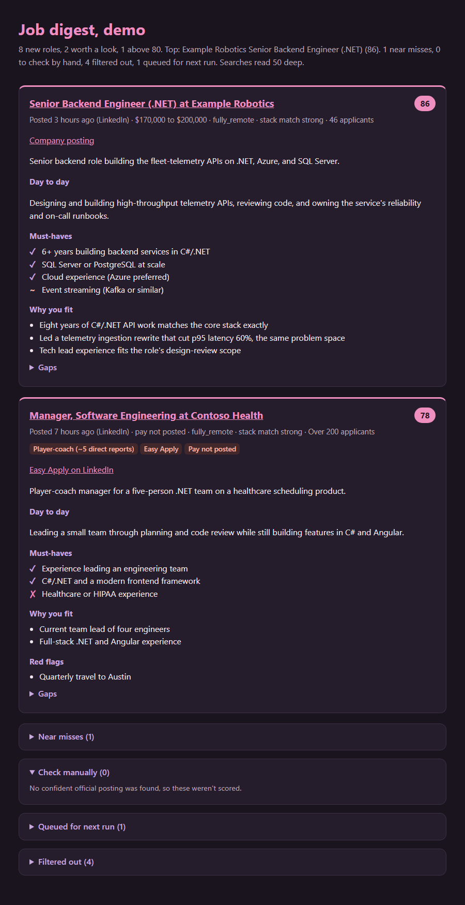

# job-hunt-pipeline

A daily GitHub Actions job that finds new roles from your LinkedIn job alerts (and, optionally, LinkedIn's full search results), drops the ones that fail your hard rules, scores the rest against your resume, and emails you one HTML digest.

It answers one question: **is this a job I want to apply to?** Each card shows:
- whether the role meets your rules;
- how well it fits, and why;
- a must-haves checklist against your resume;
- what the job actually involves day to day;
- whether a "manager" role is hands-on, player-coach, or pure people management.

It never contacts anyone. The only email it sends is the digest, to you.



*A sample digest built from fictional roles. To render it yourself, with no setup, run `dotnet run --project src/JobHunt -- --demo`.*

## How a run works

1. **Collect roles.** Roles queued from the last run come first, then jobs in unread emails with your alerts label (`gmail.alerts_label`), then the full LinkedIn searches if you turn them on (see below). Duplicates and roles already seen (`data/seen.json`) are dropped. From alert emails, only the jobs **listed in the email** are processed: LinkedIn shows about 6 per alert, even when it says "30+".
2. **Free filters.** Title words (`exclude_title_words`) and companies (`exclude_companies`) are checked in code, with no requests and no usage.
3. **Title check.** A cheap model screens titles 50 at a time and drops only clear misses from your `not_interested_in` list.
4. **LinkedIn job page** (optional, free). One logged-out request per role. The role is dropped if it's **closed**, if its **posted pay** tops out below `min_salary`, or if it's at a seniority level in `skip_seniority`. Contract and part-time roles are tagged.
5. **Company posting** (free). If the company posts on Greenhouse, Lever, or Ashby, its full posting is used instead of LinkedIn's copy, which can leave out details like location restrictions. Learned company job lists are saved in `data/boards.json`.
6. **One scoring call per role.** Claude scores fit (0–100) against your resume, using a rubric that separates minor, learnable gaps from major ones and applies your `scoring_notes`. The same call pulls out remote, countries, state residency rules, job type, and pay, and returns:
   - a must-haves checklist;
   - a day-to-day summary;
   - a people-management level;
   - an estimated pay band when none is posted.
7. **Hard rules.** Your remote rule, `countries`, `home_state`, and pay floor. Unknown pay is kept and tagged. If the pay estimate is below your floor, the role is tagged and sorted last, not dropped.
8. **Digest.** The digest has these sections:
   - **Cards:** every role at or above `min_score`.
   - **Near misses:** roles that scored just under the bar.
   - **Check manually:** roles with no usable description.
   - **Queued for next run:** roles this run didn't reach.
   - **Filtered out:** roles dropped, each with its reason.

   Cards link to the LinkedIn job, and to the company's posting when one was found.

**Everything personal lives in `config/criteria.yaml` and `config/resume.md`.** The code and prompts are generic.

## Ground rules

- **Never sends anything but the digest.** The recipient comes only from the `DIGEST_TO` secret, never from model output.
- **Your resume is the only evidence.** The scorer may not claim a skill your resume doesn't show.
- **No LinkedIn automation by default.** Out of the box it reads only the alert emails you already get. Two **opt-in** settings read LinkedIn's public, logged-out pages; see below.
- **Keep your copy private.** It holds your resume and your job-search history.

## Optional: LinkedIn's public pages

LinkedIn's terms prohibit automated access, logged in or not, so both settings are **off** by default. No login or account is ever involved. Requests are spaced 3 seconds apart, a rate limit is honored and retried once, and a second one stops LinkedIn requests for the rest of the run, with the remaining roles queued.

- **`linkedin.check_job_page`:** reads each new role's public job page. It drops closed jobs, pay below your floor, and skipped seniority levels **before any Claude usage**, then scores from the page's description.
- **`linkedin.run_searches`:** reads each search in `linkedin.searches` in full, instead of relying on the ~6 jobs per alert email. What LinkedIn's public search really does (tested Sep 2026):
  - It honors **only the keywords and the time window** (`posted_within_hours`, re-checked in code from each result's age). AND/OR/NOT are not enforced, and its remote, experience, job-type, and salary filters are ignored.
  - It returns every job posted in the window, **ranked** by your keywords, and never runs out. `max_results_per_search` sets how deep into each ranking to read.
  - `AND remote` is added to push remote roles up the ranking, and results are interleaved across searches. Everything else is checked per role.

## Run limits

These are all in `criteria.yaml` under `scoring:`.

| Setting | What it does |
|---|---|
| `run_budget_usd` | Usage budget per run, at API list price. On a subscription this isn't billed; it caps how much of your plan's limits one run can use. |
| `max_run_minutes` | Stop starting new roles after this, so the run always finishes and saves its work before GitHub's timeout. |
| `parallel_calls` | Claude calls in flight at once. |

Roles a run doesn't reach go to `data/queue.json` and are processed first next run, so nothing found is silently dropped. Every digest email ends with the run's usage.

## Setup

It takes about 30 minutes. You need a GitHub account, a Gmail account that gets LinkedIn job alerts, and a Claude Pro or Max subscription. Local testing also needs the [.NET 10 SDK](https://dotnet.microsoft.com/download) and [Claude Code](https://docs.claude.com/en/docs/claude-code).

### 1. Make your own copy

Click **Use this template → Create a new repository**, and make it **private**. Clone it locally.

### 2. Add your resume and criteria

- **`config/resume.md`:** replace it with your resume and any extra accomplishments, in markdown. The scorer may only use what's in this file.
- **`config/criteria.yaml`:** edit your pay floor, remote rule, countries, home state, title words and companies to skip, your stack and preferences in plain English, and your scoring notes. Every setting is commented.

### 3. Set up LinkedIn alerts and a Gmail label

1. Create LinkedIn job alerts: Remote filter, **Daily**, **Email**. Each alert email only shows about **6 jobs**, so several narrow searches beat one broad one. For example:
   - `senior AND ("C#" OR ".NET") AND (backend OR API)`
   - `("tech lead" OR "lead engineer") AND ("C#" OR ".NET")`
   - `(staff OR principal) AND ("C#" OR ".NET")`
2. In Gmail, search `from:(jobalerts-noreply@linkedin.com)`, then choose **Create filter** and **Apply the label** `JobAlerts`. Use the same name as `gmail.alerts_label`. Don't choose "Mark as read": the pipeline only reads unread alerts.

### 4. Create Gmail API credentials

1. In [Google Cloud Console](https://console.cloud.google.com), create a project and enable the **Gmail API**.
2. Open **OAuth consent screen** (Google Auth Platform) and choose **External**. Fill in **Branding**: app name, support email, a homepage URL, and a privacy policy URL. A simple page on your own site works; for a personal app, Google only checks that the fields are filled in.
3. Under **Data Access**, add the scopes `https://www.googleapis.com/auth/gmail.modify` and `https://www.googleapis.com/auth/gmail.send`.
4. Under **Audience**, add yourself as a test user, then **Publish app** so the status reads **In production**. Ignore the "needs verification" banner: an unverified app works fine for your own account. **Publish before step 6**: tokens issued while the app is in Testing expire after 7 days.
5. Under **Clients**, create a **Desktop app** client and download its JSON. Keep it **outside** the repo.
6. Get a refresh token. When the browser opens, click "Advanced" and then "Go to … (unsafe)" (it's your own app), and **tick both checkboxes**.
   ```
   dotnet run --project src/JobHunt -- --auth path/to/client_secret.json
   ```

### 5. Get a Claude subscription token

```
claude setup-token
```

### 6. Add repository secrets

Go to **Settings → Secrets and variables → Actions**. Or use `gh secret set NAME`, which prompts for each value.

| Secret | Value |
|---|---|
| `CLAUDE_CODE_OAUTH_TOKEN` | From `claude setup-token` |
| `GMAIL_CLIENT_ID` | From `--auth` |
| `GMAIL_CLIENT_SECRET` | From `--auth` |
| `GMAIL_REFRESH_TOKEN` | From `--auth` |
| `DIGEST_TO` | Your own email address |

### 7. Run it

Go to **Actions → daily-job-digest → Run workflow** for a first run. After that it runs every day at 10:00 UTC. To change the time, edit the `cron` line in `.github/workflows/daily.yml`.

GitHub's scheduled runs are best effort and can start hours late. For a run on time, trigger it from an outside scheduler such as [cron-job.org](https://cron-job.org) and delete the `schedule:` block so it doesn't also run twice:

- **URL:** `https://api.github.com/repos/<you>/<your-repo>/actions/workflows/daily.yml/dispatches`
- **Method:** POST, with body `{"ref":"main"}`
- **Headers:** `Authorization: Bearer <token>`, `Accept: application/vnd.github+json`, `X-GitHub-Api-Version: 2022-11-28`
- **Token:** a fine-grained personal access token for only this repo, with **Actions: Read and write**

A working call returns **204** and a new run appears under **Actions**.

## Running locally

Run these from the repo root:

```
dotnet run --project src/JobHunt -- --demo                            # sample digest, no setup
dotnet run --project src/JobHunt -- --self-test                       # offline logic checks
dotnet run --project src/JobHunt -- --parse-only fixtures             # check the alert-email parser on saved .eml files
dotnet run --project src/JobHunt -- --from-fixtures fixtures --limit 3  # full pipeline on saved emails, no Gmail
dotnet run --project src/JobHunt -- --dry-run --limit 3               # real Gmail; no send, mark-read, seen.json, or queue
dotnet run --project src/JobHunt -- --searches-only --limit 20        # full flow on the LinkedIn searches, no Gmail, dry run
dotnet run --project src/JobHunt -- --linkedin-check <id>,<id>        # check the LinkedIn job page parser (closed, pay, Easy Apply)
```

To test with your own alerts, save a few as `.eml` files in `fixtures/` (in Gmail: ⋮ → **Download message**).

## Cost and usage

With the LinkedIn job page check on, most roles are filtered for free, and each scored role costs about **$0.03–0.06 at API list price**. A run of about 150 roles cost about **$5** and took about 12 minutes in testing. On a Claude subscription this isn't billed separately; it counts toward your plan's usage limits, and `run_budget_usd` caps each run. With the job page check off, roles also need a posting lookup and cost more.

## Customizing

- **Scoring rules:** `preferences.scoring_notes` in `criteria.yaml`. The shared rubric is in `prompts/score.md`.
- **Title check:** `preferences.not_interested_in`.
- **Models:** `models.scoring` and `models.title_check`.
- **Digest look:** `templates/digest.html` is plain HTML and CSS, with the colors as CSS variables at the top.

## Troubleshooting

| Symptom | Fix |
|---|---|
| `invalid_grant` from Gmail after a week | The OAuth app was in Testing when you got the token. Publish it and rerun `--auth`. |
| "0 new jobs" from non-empty alerts | LinkedIn changed its email markup. Save a fresh alert to `fixtures/`, run `--parse-only`, and adjust `AlertParser.cs`. |
| Pay or closed checks stop working | LinkedIn changed its job page. Run `--linkedin-check` on a few job IDs to see what's no longer read. |
| The daily run starts hours late or not at all | GitHub delays or skips scheduled runs under load. Trigger it from an outside scheduler instead (see **Run it**). |
| Workflow can't push `seen.json` | Check the workflow has `contents: write` permission and that branch protection isn't blocking the bot. |

## Known limits

- **US-centric.** It was built for a US job search.
  - Pay is read as annual USD, and hourly pay is converted at 2,080 hours a year.
  - The residency rule (`home_state`) uses two-letter US states.
  - The default search location (`geo_id`) is the United States.

  Outside the US, you can set `countries` and `geo_id`, but the pay floor and state rule would need changes to the code and prompts to handle other currencies and regions.
- **Coverage depends on depth.** LinkedIn's public search ranks every job posted in the window, so reading deeper finds more but costs more requests and usage.
- **Company postings:** only Greenhouse, Lever, and Ashby are read. Many large companies use Workday, which has no public listing, so their roles are scored from LinkedIn's copy.

## License

MIT. See [LICENSE](LICENSE).

Built by [Jessica Haynes](https://www.jessbuilds.dev) with [Claude Code](https://claude.com/claude-code).
